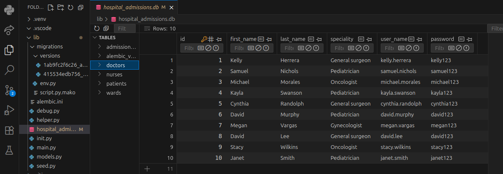
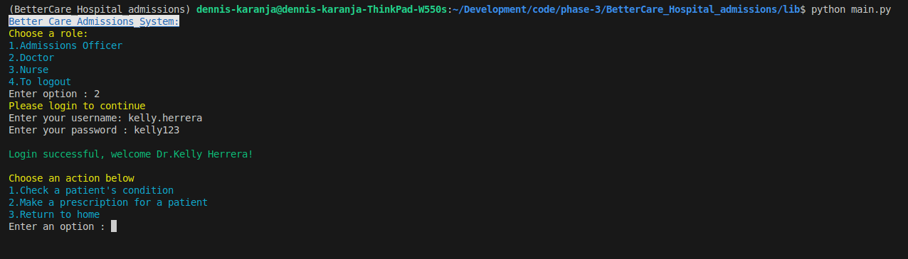
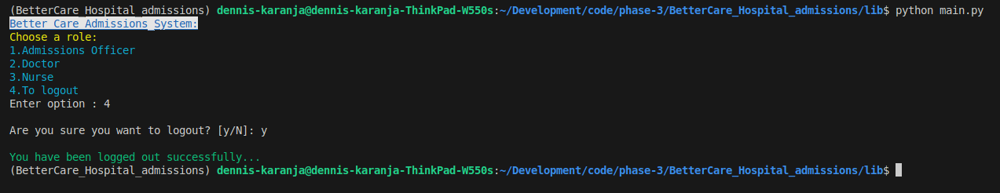

# Better_Care hospital_admissions
Better care is a quick and efficient CLI application for managing patient admission data in a hospital setting

By Dennis Karanja
## Description
Better care is a CLI application that is designed to be used by hospital staff to manage patient admission data. Admission officers can login and admit a patient by assigning them a ward,  a bed,a doctor and nurse. They may also add or remove nurses, doctors or wards from the database. A doctor can login, view the condition of patients assigned and make prescriptions for the attention of nurses. A nurse can login, update the condition of patients for the attention of doctors and view any prescriptions made by doctors so as to action them.  
## How to setup
1. Clone this repository into your gadget, through your terminal

       git clone git@github.com:Denniskaranja2023/BetterCare_Hospital_admissions.git
2. Change directory into the project directory
      
       cd BetterCare_Hospital_admissions
3. Open the project directory in a code editor
       
       code .
4. In your code editor, open terminal and install all the packages used in development enter and run the following command.
       
       pipenv install
5. Create and enter a virtiual python environment by running the command below:
    
       pipenv shell
6. Change directory to the lib directory that contains all the project files:
       
       cd lib
7. Run the following command to seed the database(populate it with arbitrary placeholder data)
       
       python seed.py
8. Run the following command on your terminal to be able to enter the CLI application
       
       python main.py
## Accessing the database
The database data appears once seed.py has been run. The database can be acessed as hospital_admissions.db. The database has five main tables: admissions_officers, doctors, nurses, patients and wards. There is also an alembic table that updates on alembic migrations

## Admissions officer role
As an admissions officer, once I enter the CLI application, I select the first option by entering 1

The username and logins of an admissions officer can be checked in the database after seeding the database. As an admissions officer:
- You can admit or discharge a patient through the option 1
- You can add or remove a doctor from the database through option 2
- You can add or remove a nurse from the database through opton 3
- You can add or remove a ward from the database through option 4
- You can return home through the option 5
## Doctor's role
As a doctor, once I enter the CLI application, I select the second option by entering 2

The username and logins of a doctor can be checked in the database after seeding the database.As a doctor:
- You can check a patient's condition through option 1 after login
- You can add a prescription for a patient through option 2
- You can return home through option 3
## Nurse's role
As a nurse, once I enter the CLI application, I select the third option by entering 3

The username and logins of a nurse can be checked in the database after seeding the database.As a nurse:
- You can check a doctor's prescription for a patient through option 1 after login
- You can record the condition of a patient through option 2
- You can return home through option 3
## Logging out
To logout as a user, navigate to home and enter the fourth option by entering 4. On entering 4, a confirmation message will appear. To logout, confirm through entering

## Other features
The CLI application is developed in such away that at almost every point, it is possible to return through either the exit option or the entering 0. 
## Technologies used
- Python
- SQlite 
- SQLAlchemy
- click
## Contacts
+254 711606734

Email: [click here](denniswanyeki2021@gmail.com)

&copy; 2025

## Licences

- MIT Licence

